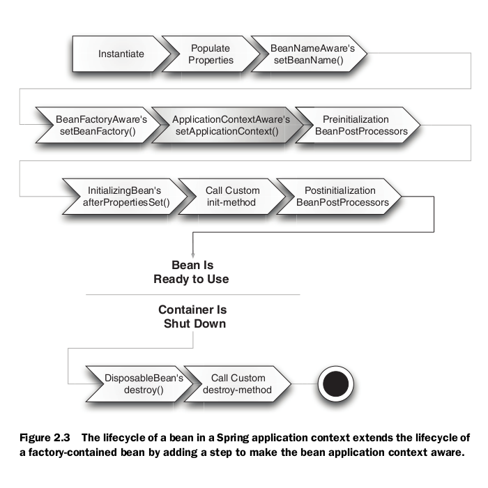

This example will show you the life cycle of spring bean.

<ul>
<li>MyBeanPostProcessor constructor of type BeanPostProcessor bean called  -- This is called only one time across application context irrespective wherever it is declared. We need to define this bean in spring configuration file in order to work his methods for all bean </li>
<li>Default constructor of a bean is called    --This is default/parameterized constructor  </li>
<li>setCustomerId is called          --All setter method if property setter is used in bean definition. </li>
<li>setBeanName is called customer    --BeanNameAware interface  </li>
<li>setBeanFactory is called  --BeanFaxtory interface </li>
<li>setApplicationContext is called    --ApplicationContextAware interface  </li>
<li>postProcessBeforeInitialization is called customer  --BeanPostProcessor interface for before  </li>
<li>afterPropertiesSet is called  --InitializingBean interface  </li>
<li>This is user defined init method --Any user defined initialization method  </li>
<li>postProcessAfterInitialization is called customer   --BeanPostProcessor interface for after  </li>
<li>destroy method is called.    --DisposableBean interface. In order to execute this method we need to register shutdowhook to the application context  </li>
<li>User defined destroyed method is called --Any user defined destroy method method. In order to execute this method we need to register shutdowhook to the application context  </li>
</ul>